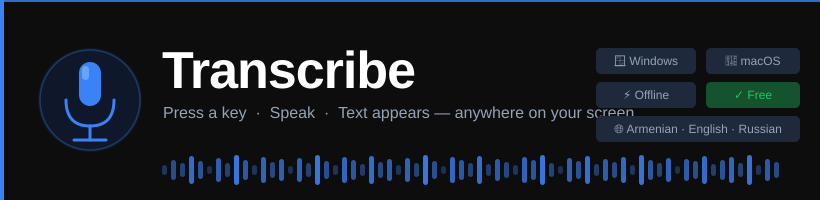

<div align="center">



<br/>

[](LICENSE)
[]()
[]()
[]()
[]()

<h3>Press a key. Speak. Your words appear — wherever your cursor is.</h3>

<p>A lightweight, always-on speech-to-text tool that lives in your system tray.<br/>
Works completely offline using Whisper AI, or connects to Google Cloud for best Armenian accuracy.</p>

**[⬇ Download for Windows (.zip)](https://github.com/Aram2K/transcribe-app/releases/latest/download/TranscribeApp-Windows.zip)** &nbsp;·&nbsp;
**[⬇ Download for macOS (.dmg)](https://github.com/Aram2K/transcribe-app/releases/latest/download/TranscribeApp-Mac.dmg)** &nbsp;·&nbsp;
[View all releases](https://github.com/Aram2K/transcribe-app/releases)

</div>

---

## What is Transcribe?

Transcribe is a hotkey-triggered dictation tool that runs silently in the background on your computer. Press your configured key, speak naturally, and when you stop — the transcription is automatically pasted wherever your cursor is: a chat window, a document, an email, a code editor, anything.

It was built especially for **Armenian speakers** who need accurate, native-script transcription (not Latin transliteration), while also supporting English, Russian, French, German, Spanish, and Arabic.

---

## Features

| | |
|---|---|
| 🎙 **Hotkey recording** | Press any key combo (or mouse button) to start/stop |
| 📋 **Smart paste** | Auto-pastes at your cursor; falls back to clipboard |
| 🌐 **Armenian-first** | Native script output — not transliteration |
| 🔒 **Fully offline** | Local Whisper AI, no data leaves your machine |
| ☁️ **Google Cloud option** | Best accuracy for Armenian via Speech-to-Text API |
| ⚡ **Streaming results** | Background chunks transcribed while you speak |
| 📊 **Waveform overlay** | Clean floating UI with live audio visualization |
| 🕘 **History log** | Searchable list of all past transcriptions |
| ⚙️ **Settings panel** | Model, language, hotkey, color — all configurable |
| 📝 **Custom vocabulary** | Seed recognition with names or domain terms |
| 🪟 **System tray** | Zero footprint until you need it |

---

## Download & Install

### Windows

1. Download **[TranscribeApp-Windows.zip](https://github.com/Aram2K/transcribe-app/releases/latest/download/TranscribeApp-Windows.zip)**
2. Extract the zip anywhere (e.g. `C:\TranscribeApp\`)
3. Double-click `TranscribeApp.exe` inside the extracted folder
4. A microphone icon appears in your system tray

> **Note:** Windows may show a "Windows protected your PC" warning the first time because the app isn't code-signed. Click **More info → Run anyway**. The app is open-source and safe.

### macOS

1. Download **[TranscribeApp-Mac.dmg](https://github.com/Aram2K/transcribe-app/releases/latest/download/TranscribeApp-Mac.dmg)**
2. Open the `.dmg` and drag the app to your Applications folder
3. Right-click → **Open** on first launch (Gatekeeper bypass for unsigned apps)
4. Grant **Accessibility** permission when prompted (required for global hotkeys):
   `System Settings → Privacy & Security → Accessibility → add TranscribeApp`

---

## How to Use

```
1.  Press Alt+R  →  overlay appears, recording starts
2.  Speak        →  waveform pulses, partial results preview
3.  Press Enter  →  transcription is pasted at your cursor
    Press Esc    →  cancel without pasting
```

Right-click the **tray icon** for History, Settings, or Quit.

---

## Backends

| Backend | Best for | Speed | Cost | Internet |
|---------|----------|-------|------|----------|
| **Local (Whisper AI)** | Privacy, offline use | 0.5–15s | Free forever | ❌ No |
| **Google Cloud** | Armenian accuracy | ~1s | 60 min/month free | ✅ Yes |

### Setting up Google Cloud (for best Armenian)

1. Go to [console.cloud.google.com](https://console.cloud.google.com)
2. Create a project → enable **Cloud Speech-to-Text API**
3. Go to **Credentials** → Create API Key
4. Paste it in **Settings → Google API Key → Test Key** to verify
5. Switch backend to **Google Cloud** and set Language to **Auto-detect** or **Armenian**

---

## Local Models

| Model | Size | Speed | Quality | RAM needed |
|-------|------|-------|---------|------------|
| `tiny` | 75 MB | ~0.5s | Good | 2 GB |
| `base` | 140 MB | ~1s | Better | 4 GB |
| `small` | 460 MB | ~3s | Great | 6 GB |
| `medium` | 1.4 GB | ~8s | Excellent | 10 GB |
| `large-v3` | 3 GB | ~15s | Best | 16 GB |

Models are downloaded automatically on first use. The app grays out models your machine can't run.

---

## Settings

Open via **right-click tray icon → Settings**.

| Setting | Description |
|---------|-------------|
| **Backend** | Local (offline) or Google Cloud |
| **Google API Key** | Paste your key; click Test to verify |
| **Model** | Whisper model size (local only) |
| **Hotkey** | Click the badge, press any key combo or mouse button |
| **Language** | Auto-detect, Armenian, English, Russian, and more |
| **Accent color** | Blue, Green, Purple, Pink, Orange, White |
| **Custom vocabulary** | Words/names to help recognition (e.g. "Aram, Claude, AI") |

---

## Auto-start on Login

**Windows** — run once:
```powershell
powershell -ExecutionPolicy Bypass -File setup_autostart.ps1
```

**macOS** — add the app to `System Settings → General → Login Items`.

---

## For Developers — Run from Source

### Requirements
- Python 3.9+
- Windows 10/11 or macOS 12+
- A working microphone

### Windows
```bash
git clone https://github.com/Aram2K/transcribe-app.git
cd transcribe-app
powershell -ExecutionPolicy Bypass -File setup.ps1
# then:
run.bat
```

### macOS
```bash
git clone https://github.com/Aram2K/transcribe-app.git
cd transcribe-app
bash setup_mac.sh
# then:
bash run.sh
```

### Configuration
Copy `config.example.json` → `config.json` and edit. The file is git-ignored (it contains your API key).

---

## Building Distributables

### Windows `.exe`
```powershell
powershell -ExecutionPolicy Bypass -File build.ps1
# Output: dist\TranscribeApp\TranscribeApp.exe  (folder, not single file)
```

### Automated CI (GitHub Actions)
Push a version tag to trigger automatic builds for both platforms:
```bash
git tag v1.0.0
git push --tags
```
GitHub Actions builds `TranscribeApp-Windows.zip` and `TranscribeApp-Mac.dmg` and creates a public release automatically.

---

## Roadmap

- [x] Local offline transcription (Whisper AI)
- [x] Google Cloud backend for best Armenian accuracy
- [x] Auto language detection (Armenian / English / Russian)
- [x] Smart paste at cursor
- [x] Streaming / chunked transcription
- [x] System tray, settings panel, history log
- [x] Custom vocabulary / prompt
- [x] macOS support
- [x] GitHub Actions CI — auto-builds .exe and .dmg on tag
- [ ] One-click `.dmg` installer (macOS)
- [ ] Configurable silence detection (auto-stop)
- [ ] Export history to CSV / TXT

---

## License

**Transcribe App** is free for personal and non-commercial use.

You **may**:
- Use it for personal dictation, study, or research
- Modify and share it (with attribution)

You **may not**:
- Sell it, sublicense it, or use it in a paid product or service
- Generate revenue from it in any way

See the full [LICENSE](LICENSE) for details. For commercial licensing inquiries: **aramatamian15@gmail.com**

---

## Author

Built by **Aram Adamyan**

[GitHub](https://github.com/Aram2K) · [Report an issue](https://github.com/Aram2K/transcribe-app/issues)

---

<div align="center">
<sub>Made with ❤️ for Armenian speakers and anyone who types too slowly.</sub>
</div>
